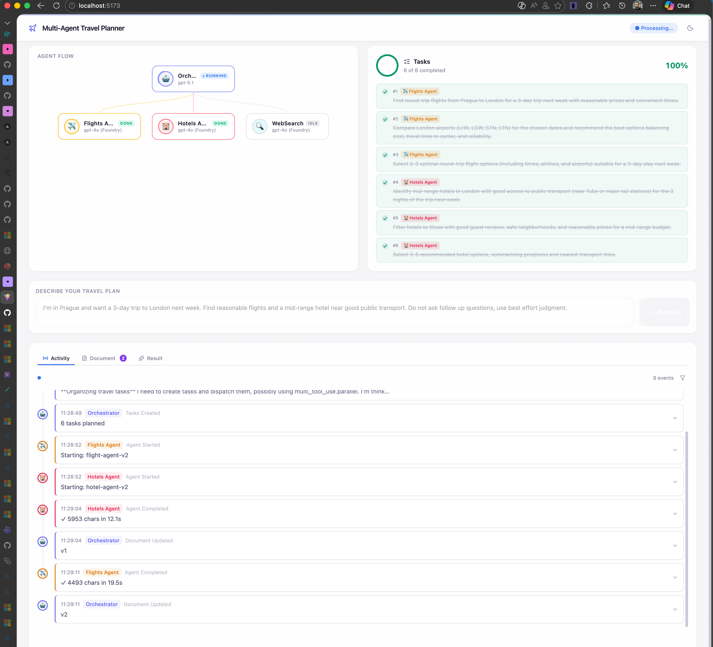

# MAF & Foundry Agent Orchestration

A multi-agent travel planning system that combines **Microsoft Agent Framework (MAF)** as the orchestrator with **Azure AI Foundry** specialist agents. Features a real-time web UI with SSE event streaming.



## Architecture

```
┌─────────────────────────────────────────────────────┐
│                   Web UI (React)                    │
│        Vite · Tailwind CSS · Framer Motion          │
└──────────────────────┬──────────────────────────────┘
                       │ SSE / REST
┌──────────────────────▼──────────────────────────────┐
│               FastAPI Backend (api.py)              │
│         POST /api/run · GET /api/stream/:id         │
│         GET /api/result/:id · GET /api/agents       │
└──────────────────────┬──────────────────────────────┘
                       │
┌──────────────────────▼──────────────────────────────┐
│          MAF Orchestrator (Responses API)            │
│    Scratchpad: TaskBoard + SharedDocument            │
│    Delegates tasks via FunctionTool per agent        │
└───────┬──────────────┬──────────────┬───────────────┘
        │              │              │
   ┌────▼────┐   ┌────▼────┐   ┌────▼────┐
   │ ✈️ Flight│   │ 🏨 Hotel │   │ 🔍 Web  │
   │  Agent  │   │  Agent  │   │ Search  │
   └─────────┘   └─────────┘   └─────────┘
   Azure AI Foundry Prompt Agents (YAML-defined)
```

**Key patterns:**
- **Scratchpad Memory** — shared `TaskBoard` (progress tracking) and `SharedDocument` (collaborative output) accessible to all agents
- **YAML-driven agents** — sub-agents defined declaratively in `agents/*.yaml`, auto-loaded as MAF `FunctionTool`s
- **Real-time streaming** — events from all agents propagated via SSE to the frontend (async dispatch with `asyncio.to_thread`)

## Prerequisites

- Python 3.11+
- Node.js 18+
- Azure AI Foundry project with deployed Prompt Agents (`flight-agent-v2`, `hotel-agent-v2`, `WebSearch`)
- Azure OpenAI deployment (e.g. `gpt-5.1`) for the orchestrator

## Setup

### 1. Environment variables

Create a `.env` file:

```env
PROJECT_ENDPOINT=https://<your-foundry-endpoint>/api/projects/<project>
AZURE_OPENAI_CHAT_DEPLOYMENT_NAME=gpt-5.1
```

Authentication uses `DefaultAzureCredential` — ensure you are logged in via `az login`.

### 2. Backend

```bash
# Install dependencies (using uv)
uv sync

# Run tests
uv run pytest

# Start API server
uv run uvicorn src.api:app --reload --port 8000
```

### 3. Frontend

```bash
cd frontend
npm install
npm run dev          # Next.js dev server at http://localhost:3000
npm run build        # Production build
npm run start        # Run the production build
```

The Next.js frontend rewrites `/api/*` requests to the backend at `http://localhost:8000` by default. Override the backend origin with `BACKEND_API_URL` if needed.

## Project Structure

```
agents/              # YAML agent definitions (flights, hotels, websearch)
src/
  api.py             # FastAPI server + SSE streaming
  orchestrator.py    # MAF orchestrator setup
  agent_loader.py    # YAML agent parser + loader
  events.py          # Event types and callback definitions
  config.py          # Environment configuration
  scratchpad/
    workflow.py      # Main workflow entry point
    dispatcher.py    # Async dispatch to Foundry agents
    taskboard.py     # Task tracking scratchpad
    shared_document.py  # Collaborative document scratchpad
frontend/
  app/
    page.tsx         # Next.js App Router entry point
    globals.css      # Global theme and layout styles
  components/        # Query composer, roster, task board, workspace panels, etc.
  lib/               # Typed models and UI metadata helpers
docs/                # PRD and design documents
tests/               # Backend test suite
```

## Usage

1. Start both backend and frontend
2. Open `http://localhost:3000`
3. Enter a travel planning request (e.g. *"Plan a 5-day trip to Tokyo from NYC, budget $3000"*)
4. Watch agents collaborate in real-time — tasks appear, agents activate, and a travel document is built incrementally

For UI tuning without running the full backend flow, use the **Load mock replay** control in the query composer. It loads a completed maintenance-style run fixture directly in the browser so you can refine the layout, telemetry cards, long activity feed, task board, and document/result panes offline.

## License

MIT
